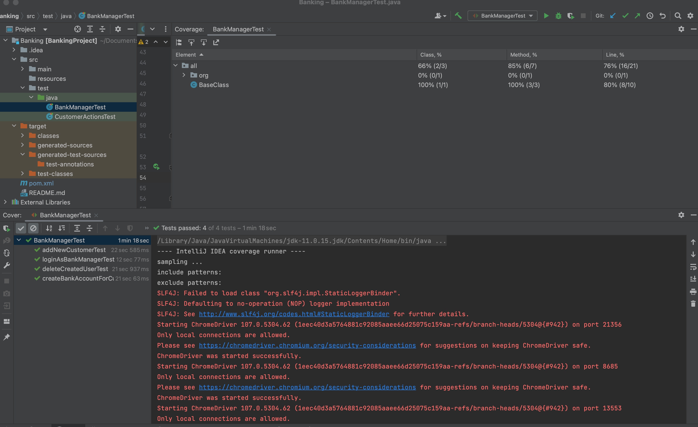

## About the project

* This project is written in java and uses Maven as a build tool.
* Junit is also used

### The Task

1. [ ]  Access the link: https://www.globalsqa.com/angularJs-protractor/BankingProject/
2. [ ]  Create automated tests that covers all the test scenarios for the following Processes
   (Should be guided by the manual test cases done):
   1. [ ]  Login as ‘Bank Manager’, add a customer.
   2. [ ]  Create a bank account for the customer specified above in (i) above.
   3. [ ]  Login as the customer specified in (i) above.
   4. [ ]  Login as the customer, verify if the account number created above is similar.
   5. [ ]  Perform 2 different transactions. Verify the transactions in the Transaction Tab.
   6. [ ]  Login as Bank Manager and delete the created account.

### Setup

* Open your IDE preferably Intellij and clone the repo
  * You could use `HTTPS` method https://github.com/johnswekenyi/Banking.git or
  * `SSH`: git@github.com:johnswekenyi/Banking.git
* After importing the project, allow a few minutes for maven to download the dependecies

### Runing tests:

* You can run the tests directly from the IDE you are using or using keyboard shorcut commands to run the tets
  * Mac - CTR + R
  * Windows - CTR + R

### Sample test results with coverage for bank

